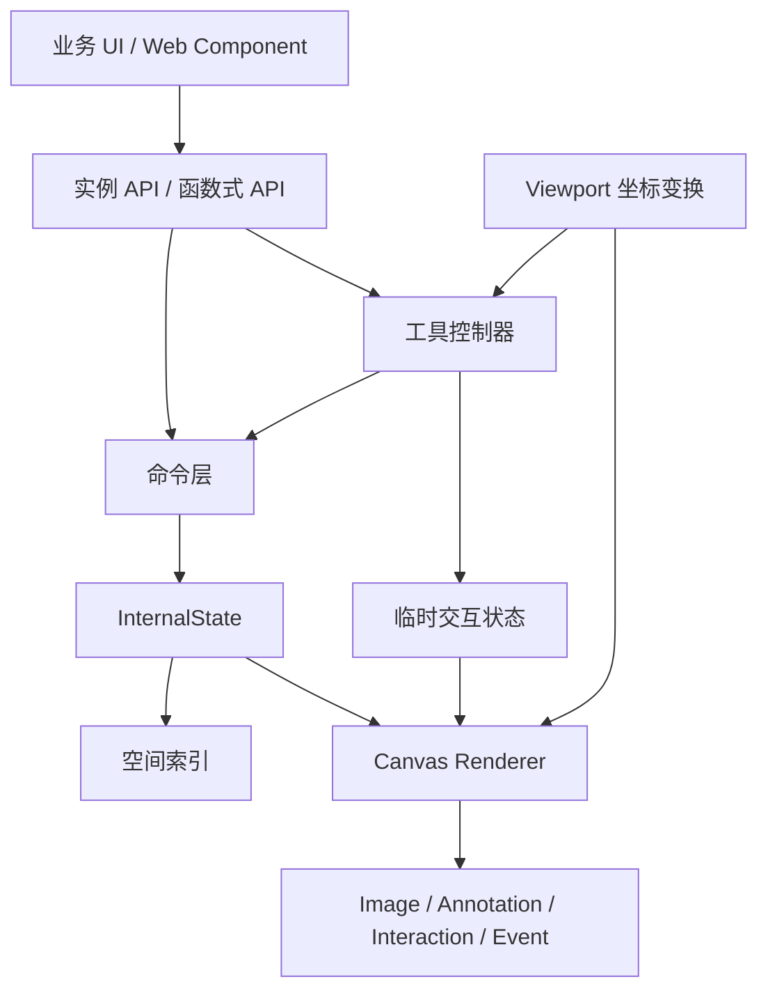

# cs-label-tool 面试讲解手册

这份文档不是 API 说明书，而是一套面试时的讲法。目标是让面试官听明白三件事：项目解决了什么问题、最难的地方是什么、你为什么这样设计。

## 先记住一句话

`cs-label-tool` 是一个不依赖前端框架的图片标注引擎。它用分层 Canvas 渲染图片和标注，用统一的原图坐标保存数据，支持矩形、多边形、涂抹、橡皮擦、选择编辑、缩放平移、撤销重做和自定义工具。

## 30 秒版本

> 我做了一个 TypeScript 图片标注库，核心不是画几个图形，而是把渲染、坐标转换、工具交互和数据命令拆开。渲染层用了四层 Canvas，标注数据始终保存在原图坐标，缩放和平移只改变 viewport。矩形和多边形通过状态机处理，涂抹和橡皮擦使用二进制 mask 和 RLE，擦断后会做连通域分割。项目同时提供函数式 API、实例 API 和 Web Component，目前有 64 个单元测试和 45 个三浏览器端到端测试。

## 2 分钟版本

可以按这个顺序讲：

1. 业务上需要在大图上画矩形、多边形和 mask，还要支持缩放后继续精确编辑。
2. 我把状态保存到一个独立引擎里，UI 只调用 API，不直接修改数据。
3. 所有标注都保存为原图坐标，viewport 只负责原图坐标和屏幕坐标互转。
4. Canvas 分成图片、持久标注、临时交互和事件四层，某一层变化时不用全部重画。
5. 工具统一成 `down/move/up/cancel` 输入，每个工具自己维护状态机。
6. 矩形和多边形是矢量几何；涂抹和橡皮擦是二进制 mask，使用 RLE 保存。
7. 橡皮擦做 mask 差集，擦断后用 8 邻域 BFS 拆成多个独立标注；拖动相近的同标签 mask 时再做合并。
8. 命令层负责新增、修改、删除和撤销重做，空间索引用来减少区域查询范围。
9. 最后用 Vitest 测算法和状态机，用 Playwright 在 Chromium、Firefox、WebKit 验证真实鼠标交互。

## 项目基本信息

| 项目项 | 说明 |
| --- | --- |
| 语言 | TypeScript，ESM |
| 运行时依赖 | 无 |
| 渲染 | Canvas 2D |
| UI | 可选原生 Web Component |
| 标注类型 | Rectangle、Polygon、Mask |
| 工具 | Select、Rectangle、Polygon、Brush、Eraser |
| 测试 | Vitest + Playwright |
| 浏览器 | Chromium、Firefox、WebKit |
| 当前版本 | `2.0.0-alpha.1` |

## 架构怎么讲



可以把代码分成八块：

| 目录 | 责任 |
| --- | --- |
| `src/core` | 状态、数据类型、命令、事件、快照 |
| `src/tools` | 工具状态机、指针输入、选择编辑、工具注册 |
| `src/render` | Canvas 分层、脏层调度、实际绘制 |
| `src/viewport` | 缩放、平移、坐标转换 |
| `src/mask` | RLE、合并、差集、连通域、平移 |
| `src/spatial` | 网格空间索引 |
| `src/image` | 图片加载和 viewport 命令 |
| `src/components` | 默认 Web Component UI |

### 为什么不把所有逻辑写在组件里

因为组件只是一种接入方式。核心引擎不依赖 React、Vue 或 Web Component，业务可以自己做工具栏、标签列表和快捷键。这样算法和交互也更容易做单元测试。

## 数据模型

标注只有三种几何：

```ts
type Annotation = RectAnnotation | PolygonAnnotation | MaskAnnotation

interface RectGeometry {
  type: 'rect'
  x: number
  y: number
  width: number
  height: number
}

interface PolygonGeometry {
  type: 'polygon'
  points: readonly (readonly [number, number])[]
}

interface MaskGeometry {
  type: 'mask'
  width: number
  height: number
  rle: readonly number[]
}
```

每条标注还有 `id`、`labelId`、`revision`、创建时间、更新时间、来源、状态和 metadata。

### 为什么数据都用原图坐标

如果保存屏幕坐标，缩放一次后数据就要跟着改，累计误差也会越来越大。当前实现中，标注数据永远不因缩放和平移改变；viewport 只在绘制和指针输入时做转换。

## 最重要的难点：坐标系统

项目里有三套坐标：

1. 原图坐标：标注真正保存的坐标。
2. viewport 坐标：Canvas 容器里的 CSS 像素坐标。
3. Canvas backing store 坐标：乘过 `devicePixelRatio` 的真实像素。

核心公式是：

```text
screenX = imageX * scale + offsetX
screenY = imageY * scale + offsetY

imageX = (screenX - offsetX) / scale
imageY = (screenY - offsetY) / scale
```

Canvas 绘制时再乘 DPR：

```ts
context.setTransform(
  dpr * scale,
  0,
  0,
  dpr * scale,
  dpr * offsetX,
  dpr * offsetY,
)
```

### 鼠标锚点缩放怎么保证不跳

先算出鼠标下面的原图点，再根据新 scale 反推 offset：

```text
imageAnchor = screenToImage(oldViewport, mousePoint)
newOffset = mousePoint - imageAnchor * newScale
```

这样缩放前后，鼠标下面始终是同一个原图点。

### 控制点为什么缩放后大小不变

矩形控制点和多边形顶点应该固定为屏幕上的 8px，而不是原图上的 8px。因此绘制尺寸和命中容差都要除以 scale：

```ts
const handleSize = 8 / scale
const hitTolerance = 8 / scale
```

### 曾经遇到的真实问题

缩放和标注更新后，annotation 层重绘了，但 interaction 层没有同步重绘，导致控制点看起来在旧位置，鼠标实际命中却在新位置。修复方式不是调大容差，而是让 viewport 和 annotation 变化都失效 interaction 层。

## 为什么使用四层 Canvas

四层从下到上分别是：

1. `image`：底图。
2. `annotations`：已经保存的标注。
3. `interaction`：绘制预览、选框、顶点、拖动预览。
4. `event`：透明事件层，只负责接收鼠标和键盘。

这样做有三个好处：

- 拖动控制点时只重画 interaction 层，不必重新画底图。
- 事件始终由最上层接收，不会因为绘制顺序改变。
- 图片、标注和临时状态的生命周期分开，问题更容易定位。

渲染调度器用 `requestAnimationFrame` 合并同一帧的多次失效请求：

```text
invalidate(image)
invalidate(annotation)
invalidate(interaction)
        ↓
下一帧一次性绘制所有 dirty layers
```

## 工具系统和状态机

所有工具接收统一输入：

```ts
type NormalizedPointerInput =
  | { type: 'cancel' }
  | {
      type: 'down' | 'move' | 'up'
      pointerId: number
      imagePoint: Point
      buttons: number
      pressure: number
      detail: number
    }
```

工具不直接处理浏览器坐标。控制器先把 PointerEvent 转成原图坐标，再交给当前工具。

### 矩形工具

状态只有 `idle` 和 `drawing`：

```text
idle --pointerdown--> drawing
drawing --pointermove--> 更新 draft
drawing --pointerup--> 提交矩形并回到 idle
任意状态 --cancel--> idle
```

### 多边形工具

每次点击增加一个点，移动鼠标只更新预览点。`Enter` 或双击提交，`Backspace` 删除最后一个点。提交前会检查点数、自相交和零面积。

### 选择工具

选择工具要处理的状态更多：

- 点击内部：移动标注。
- 点击矩形边或控制点：八方向缩放。
- 点击多边形顶点：移动该顶点。
- 同一位置有多个标注：重复点击循环选择。
- 点击空白：清空选择。

矩形边框编辑和顶点编辑都在原图坐标中完成，因此缩放后不会改坏数据。

### Pointer Capture

`pointerdown` 后调用 `setPointerCapture()`。即使鼠标拖出 Canvas，当前手势仍能收到 move 和 up。否则拖到边缘时很容易丢失提交事件。

### 临时平移

按住空格、中键或 `Alt + 左键` 时，控制器临时进入平移状态，并取消当前未完成的绘制。滚轮缩放以鼠标位置为锚点，不切换当前工具。

## Mask、涂抹和橡皮擦

### 为什么 Mask 使用 RLE

Mask 本质是与原图同尺寸的 0/1 数组。直接保存 `Uint8Array` 简单，但大图占用明显。RLE 把连续的 0 和 1 记录成长度数组，适合大面积连续区域，也方便 JSON 序列化。

当前 RLE 从 0 开始交替记录：

```text
像素: 0 0 0 1 1 0 0 1
RLE:  [3, 2, 2, 1]
```

### 涂抹怎么生成 Mask

1. 收集 pointerdown 到 pointerup 之间的原图坐标点。
2. 对相邻点插值，避免鼠标移动太快产生断线。
3. 在每个采样点画圆，半径是画笔直径的一半。
4. 与同标签、发生重叠的 mask 做 OR 合并。
5. 编码为 RLE 后提交。

### 橡皮擦为什么只擦 Mask

橡皮擦先把擦除轨迹也转成二进制 mask，然后做差集：

```text
next = source AND NOT eraser
```

候选数据只筛选 `geometry.type === 'mask'`，所以矩形和多边形不会被误删。

### 实时透明擦除怎么做

拖动时不立即写历史记录，而是在临时离屏 mask Canvas 上使用 `destination-out` 显示预览。pointerup 后再一次性修改数据。这样既能实时看到底图，也不会每移动一次鼠标就增加一条 undo。

### 擦断后为什么会变成多个标注

差集可能把一个区域切成几块。项目使用 8 邻域 BFS 做连通域分割：

```text
扫描每个为 1 且未访问的像素
  -> 从该点开始 BFS
  -> 上下左右和四个对角都算相连
  -> 得到一个独立 component
```

每个 component 保存成独立 annotation，因此可以单独点击、改标签和删除。

### 拖近后怎么合并

拖动 mask 完成时，只检查同标签、同尺寸的其他 mask。若两块像素的最短距离进入阈值，就做 OR 合并并删除重复 annotation。阈值从固定屏幕像素换算到原图坐标，所以不同缩放级别下手感一致。

## 数据命令和撤销重做

新增、修改和删除都通过命令层，不允许 UI 直接改内部数组。

每条历史记录保存两个闭包：

```ts
interface HistoryEntry {
  undo(state: InternalState): void
  redo(state: InternalState): void
}
```

执行命令时：

1. 调用 redo 修改状态。
2. 增加 revision。
3. 写入 undoStack。
4. 清空 redoStack。
5. 发出 change 事件。

对外快照会深拷贝并冻结，业务代码不能绕过命令层偷偷修改内部状态。

## 空间索引

如果每次选中和渲染都遍历全部标注，数据量上来后会越来越慢。当前实现用固定网格索引：

- 标注按几何边界写入网格单元。
- 查询可视区域或鼠标附近时，只返回相交网格里的候选。
- 最后再做精确的矩形、多边形或 mask 像素命中。

这是“粗筛 + 精确判断”的两阶段方案。

## API 为什么有三种形式

### 函数式 API

```ts
useRect(annotator, options)
addRect(annotator, input)
```

适合框架集成、单元测试和按需组合。

### 实例 API

```ts
editor.tools.rect(options)
editor.addRect(input)
```

不用反复传 annotator，更适合业务页面。

### Web Component

提供一个能直接运行的默认界面，但不限制业务必须使用它。

这三层共用同一个引擎，不会出现三套行为。

## 生命周期和资源清理

图片加载使用 `AbortController`。切换图片时会中止旧请求，并检查异步加载完成后 source 是否仍是当前 source，避免旧图片晚到后覆盖新图片。

销毁时会清理：

- Pointer 和键盘监听。
- Canvas DOM。
- requestAnimationFrame。
- 图片资源和 AbortController。
- 订阅者集合。
- 工具状态和选择状态。

## 测试怎么讲

### 单元测试

Vitest 主要覆盖：

- viewport 正反向坐标转换。
- 矩形、多边形几何与状态机。
- RLE 编解码、mask 合并、差集和分割。
- 命令、快照不可变性、事件和撤销重做。
- 空间索引和区域查询。
- 工具 API 和生命周期。

### 浏览器测试

Playwright 在 Chromium、Firefox、WebKit 中验证：

- DPR Canvas 尺寸和真实图片像素。
- 鼠标绘制矩形、多边形和 mask。
- 八方向矩形缩放和多边形顶点编辑。
- 4 倍缩放后继续编辑是否命中。
- 空格平移和滚轮缩放后坐标是否对齐。
- 橡皮擦实时透明预览、分割和独立选择。
- 重叠标注循环选择。
- 组件卸载后的资源清理。

当前验证结果是 64 个单元测试和 45 个浏览器测试。

## 可以主动讲的踩坑

### 1. 缩放后控制点看得到但拖不动

原因是 interaction 层没有随 viewport 或 annotation 更新。修复是统一失效 interaction 层，而不是硬调命中容差。

### 2. 涂抹工具没有按鼠标也会生成 Mask

早期实现把所有 pointermove 都加入笔迹，没有校验当前 pointerId 和 `buttons & 1`。修复后只有 pointerdown 建立手势，后续 move/up 必须匹配同一个 pointerId。

### 3. 橡皮擦抬起后才看到结果

数据只在 pointerup 提交是对的，但视觉预览不能等。后来增加 eraser draft，在渲染阶段用透明差集预览，提交仍保持一次。

### 4. 橡皮擦预览出现白线

白线来自 interaction Canvas 上额外画的粗白笔迹，不是真正的透明擦除。删除白线，只在 mask 的离屏 Canvas 上使用 `destination-out`。

### 5. 擦断后的块看起来选不中

数据已经能按像素命中，但 mask 没有选中边框，用户没有反馈。后来按实际像素边界绘制蓝色虚线框，同时保留像素级命中。

### 6. Alt 平移同时触发绘图

平移逻辑最初写在 demo 外层，事件仍会传给工具控制器。后来把空格、中键和 Alt 平移统一收进控制器，平移手势会拦截绘制输入。

## 设计取舍

### Canvas 还是 SVG

选择 Canvas 的原因：

- 大图片和像素级 mask 更适合 Canvas。
- 多层重绘和离屏合成比较直接。
- 不会为每个像素区域创建大量 DOM 节点。

代价是命中测试、焦点、无障碍和编辑控制点都要自己实现。项目通过透明事件层、空间索引和几何命中来处理这些问题。

### 为什么不是单个 Canvas

单 Canvas 代码少，但每次交互都要重画图片和全部标注，临时状态也容易污染持久状态。四层 Canvas 多了一点管理成本，换来了更清晰的职责和更小的重绘范围。

### 为什么不用 Fabric.js 或 Konva

如果业务只需要矩形、多边形拖拽，成熟库会更快。但这个项目还需要原图坐标、像素 mask、RLE、橡皮擦分割和可控的数据命令层。自行实现可以让数据结构和行为完全围绕标注业务设计。

面试时不要说第三方库“不好”，应该说取舍不同。

## 当前限制和下一步

这些限制可以主动说，体现你知道系统还可以怎么演进：

1. Mask 每次编辑会解码成全图 `Uint8Array`，大图和大量 mask 下需要 Worker、分块 mask 或局部更新。
2. Mask 当前空间索引边界仍可进一步收紧到实际像素 bounds，减少候选数量。
3. Mask 渲染每次会创建离屏 Canvas，可增加按 annotation revision 缓存。
4. 一次擦除拆成多个 annotation 时，历史记录还可以升级成事务命令，保证一次手势对应一次 undo。
5. 当前选择状态结构支持数组，但主要交互仍是单选；后续可加入框选和多选批量变换。
6. 可加入压力感应、触控双指缩放、旋转框和 AI 预标注确认流程。
7. 可补充性能基准数据，例如一万标注的查询时间和连续涂抹帧率。

不要把下一步说成“还没做完”，可以说当前版本先完成核心闭环，下一阶段重点是大数据量性能和更完整的编辑事务。

## 面试官常问问题

### Q1：为什么要有原图坐标和屏幕坐标两套坐标？

因为缩放和平移属于视图状态，不应该修改业务数据。原图坐标保证导出稳定，屏幕坐标只负责显示和输入。

### Q2：缩放后为什么不会错位？

渲染和指针输入共用同一个 viewport。绘制走 image-to-screen，鼠标走 screen-to-image，它们是同一个矩阵的正反变换；DPR 只在 Canvas backing store 层处理。

### Q3：为什么控制点大小要除以 scale？

控制点应该在屏幕上保持固定大小。如果直接使用原图 8px，放大后会变得很大，缩小后会看不见。

### Q4：怎么选中重叠标注？

先用空间索引查鼠标附近候选，再做精确命中，按渲染顺序反转。对同一点重复点击时记录候选 ID 和下一个索引，循环选择。

### Q5：涂抹为什么不会断线？

相邻 PointerEvent 之间按距离插值，再在插值点画圆。采样步长与笔刷半径相关。

### Q6：橡皮擦为什么不直接操作 Canvas 像素？

Canvas 只是视图。如果直接擦 Canvas，数据和画面会不一致，也无法导出和撤销。橡皮擦必须修改 mask 数据，再让 renderer 根据数据重画。

### Q7：为什么用 8 邻域而不是 4 邻域？

绘制出来的斜线经常只在对角线上接触。使用 4 邻域会把视觉上连续的斜线拆开，8 邻域更符合画笔区域的直觉。

### Q8：撤销重做怎么实现？

每个命令保存 redo 和 undo 闭包。执行时写 undo 栈并清空 redo 栈，撤销时反向执行并把记录放到 redo 栈。

### Q9：为什么快照要冻结？

防止业务拿到快照后直接改内部对象，绕过 revision、历史记录、空间索引和渲染失效逻辑。

### Q10：怎么避免每个 pointermove 都重画？

工具只标记脏层，scheduler 用 requestAnimationFrame 把同一帧的多次请求合并。

### Q11：项目怎么接入 React 或 Vue？

核心是 headless API。框架组件只需要在 mount 时创建 editor，事件里读取 snapshot，在 unmount 时 destroy。框架不直接持有 Canvas 内部状态。

### Q12：如何处理图片切换竞态？

每次加载创建 AbortController。新请求开始时中止旧请求，旧请求完成后还要检查当前 source 是否仍匹配，双重防止旧结果覆盖新图。

### Q13：如果数据达到一万条怎么办？

矢量标注先靠空间索引和可视区域裁剪。Mask 还需要进一步做 bounds 收紧、离屏缓存、Worker 解码和分块存储。回答时要区分已经实现和计划优化。

## 面试现场代码讲解顺序

如果面试官让你打开代码，建议按这个顺序：

1. `src/core/types.ts`：先讲数据模型。
2. `src/core/state.ts`：讲整体状态和模块关系。
3. `src/viewport/viewport.ts`：讲坐标变换。
4. `src/render/canvas-layers.ts`：讲四层 Canvas。
5. `src/tools/controller.ts`：讲统一输入和 Pointer Capture。
6. `src/tools/rect-tool.ts`：用最简单状态机热身。
7. `src/tools/select-tool.ts`：讲编辑和重叠选择。
8. `src/tools/brush-tool.ts`、`eraser-tool.ts`：讲 mask 业务。
9. `src/mask/rle.ts`：讲算法。
10. `src/core/commands.ts`：讲历史记录和数据一致性。
11. `tests/browser/vector-editing.spec.ts`：最后用测试证明缩放后仍能编辑。

## 简历描述参考

可以写成下面这种形式，按实际岗位删减：

> 独立设计并实现无框架依赖的 TypeScript 图片标注引擎，基于四层 Canvas 和统一 viewport 支持矩形、多边形、像素 Mask 的绘制与编辑；实现 RLE、笔迹插值、Mask 差集、8 邻域连通域分割及近距离合并；通过命令模式、不可变快照、空间索引和 RAF 脏层调度保证数据一致性与交互性能；使用 Vitest 与 Playwright 覆盖三浏览器下的缩放编辑、橡皮擦和生命周期流程。

不要写没有测量过的性能提升百分比，也不要把“支持一万条标注”写进简历，除非已经有基准数据。

## 最后收尾怎么说

> 这个项目让我真正处理了 Canvas 工具类产品最容易出问题的部分：坐标一致性、交互状态、像素数据和撤销历史。功能本身可以继续增加，但我更看重的是目前已经把数据、视图、工具和 API 的边界拆清楚，并且用跨浏览器测试把关键流程固定下来。
